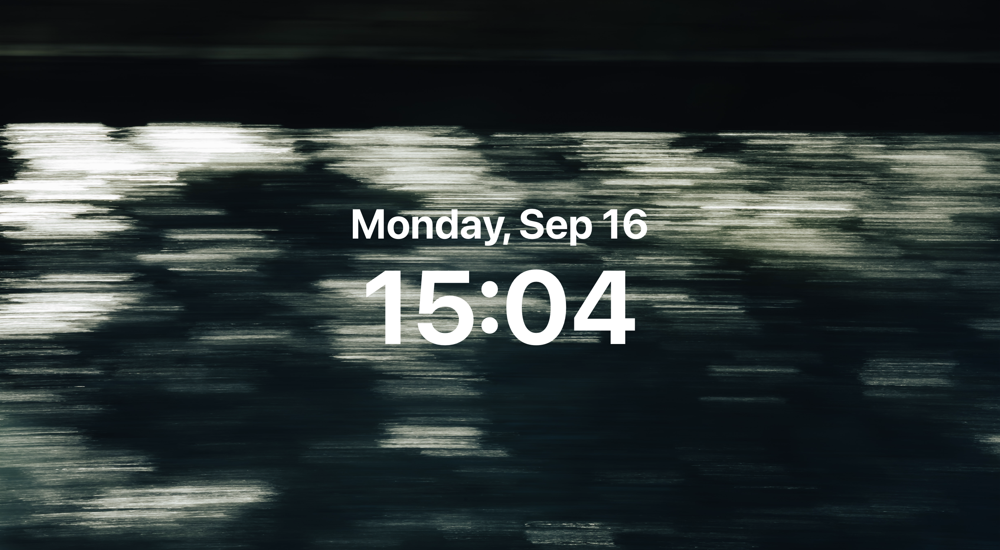

# Clock Widget for macOS

A simple, transparent desktop clock widget for macOS written in Python, using PyObjC and AppKit frameworks.

## Overview

This application displays the current date and time on your desktop with a sleek and minimalistic design. It is intended to blend seamlessly with your wallpaper, providing a constant reminder of the time without interfering with your workflow.



## Features

- **Transparent Background**: Blends with any desktop wallpaper.
- **Always on Desktop**: Stays behind all windows and appears on all virtual desktops (Spaces).
- **Minimal Footprint**: Does not appear in the Dock or menu bar.
- **Customizable**: Easily adjust the time zone or appearance in the code.

## Requirements

- **macOS**: Tested on macOS Mojave and later.
- **Python 3.x**: Ensure Python 3 is installed on your system.
- **PyObjC**: Python bindings for macOS Objective-C frameworks.
- **py2app**: To build the application as a standalone app (optional).

## Installation

### 1. Clone the Repository

```bash
git clone https://github.com/cyrus-git/clock-widget.git
cd clock-widget
```

### 2. Install Dependencies

Install the required Python packages using `pip`:

```bash
pip install pyobjc
```

- **Note**: If you're using a virtual environment, activate it before installing the packages.

### 3. Run the Script

You can run the clock widget directly from the terminal:

```bash
python clock_widget.py
```

- **Note**: The widget will appear on your desktop, and the terminal can be closed after launching the application.

## Building a Standalone Application with `py2app`

To run the widget without the terminal and integrate it into your Applications folder, you can build it as a standalone app.

### 1. Install `py2app`

```bash
pip install py2app
```

### 2. Create `setup.py`

A `setup.py` file is included in the repository. If you need to create one, here is the content:

```python
from setuptools import setup

APP = ['clock_widget.py']
OPTIONS = {
    'argv_emulation': True,
    'iconfile': 'icon.icns',  # Optional: Provide your own icon file
    'plist': {
        'LSUIElement': True,  # Hide the app from Dock and App Switcher
    },
    'packages': ['objc'],
}

setup(
    app=APP,
    name='ClockWidget',
    options={'py2app': OPTIONS},
    setup_requires=['py2app'],
)
```

- **Note**: If you have an icon file (e.g., `icon.icns`), place it in the same directory and specify its name in `iconfile`.

### 3. Build the Application

Run the following command in the terminal:

```bash
python setup.py py2app
```

- This command will create a `dist` directory containing `ClockWidget.app`.

### 4. Run the Application

Navigate to the `dist` directory and launch the app:

```bash
open dist/ClockWidget.app
```

- You can move `ClockWidget.app` to your `Applications` folder for easier access.

## Customization

### Change Time Zone

The widget is set to display time in the **Asia/Tokyo** time zone. To change it:

1. Open `clock_widget.py` in a text editor.
2. Find the lines setting the time zone:

   ```python
   NSTimeZone.timeZoneWithName_("Asia/Tokyo")
   ```

3. Replace `"Asia/Tokyo"` with your desired time zone name (e.g., `"America/New_York"`).

- **List of Time Zone Names**: You can find the list of valid time zone names in the [IANA Time Zone Database](https://www.iana.org/time-zones).

### Adjust Appearance

- **Font Sizes**: Modify the `setFont_` methods to change font sizes.
- **Colors**: Change `setTextColor_` to adjust text color.
- **Positions**: Adjust the frame values in `initWithFrame_` to reposition the labels.

## Dependencies

- **PyObjC**: Provides Python bindings for Objective-C frameworks. [PyObjC Documentation](https://pyobjc.readthedocs.io/en/latest/)
- **py2app**: Allows you to convert Python scripts into standalone macOS applications. [py2app Documentation](https://py2app.readthedocs.io/en/latest/)

## Troubleshooting

- **Application Not Launching**: Ensure that all dependencies are installed and that you're using the correct Python version.
- **Icon Not Displayed**: If your custom icon doesn't appear, verify the `icon.icns` file path and ensure it's specified correctly in `setup.py`.
- **Permission Issues**: If you encounter permission errors, try running the build command with `sudo` or adjust your directory permissions.

## Contributing

Contributions are welcome! Please follow these steps:

1. Fork the repository.
2. Create a new branch: `git checkout -b feature/YourFeature`
3. Commit your changes: `git commit -am 'Add your feature'`
4. Push to the branch: `git push origin feature/YourFeature`
5. Create a new Pull Request.
